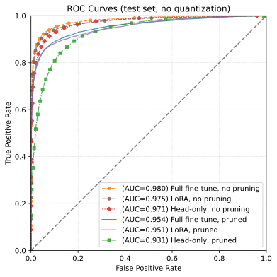

# tiny-DINOv3-FT-PCam

Compress & specialize a small DINOv3 (ViT‑S/16) for the PCam histology benchmark.

> TL;DR:
>
> * Strong PCam classifier from a DINOv3 ViT‑S/16 backbone @ 224×224.
> * LoRA fine‑tuning matches near full fine‑tune while training only adapters.
> * Graph‑safe compression (attention‑head & MLP pruning + per‑layer SVD) → \~7% fewer params in this pass; shows the end‑to‑end tooling is solid, though more aggressive settings would be needed for big savings.
> * Everything is reproducible with `make` (local M‑series or A100 cluster) and logged to W\&B.


## Key results (PCam test set)

Main metric = AUROC. All runs use 224×224 inputs and TTA at evaluation.

<p align="center">
  
</p>


| Method | Quantization | Parameters | GFLOPs | Memory (MB) | AUROC | AUPRC | Sens \@95%Spec | ECE | Brier | Acc | NLL |
| --- | --- | --- | ---: | ---: | ---: | ---: | ---: | ---: | ---: | ---: | ---: |
| Full fine‑tune | none (f32) | 21.60M | 8.67 | 86.5 | 0.9800 | 0.9820 | 0.9202 | 0.0209 | 0.0603 | 0.9202 | 0.2116 |
| - | bf16 | 21.60M | 8.67 | 43.3 (↓50.0%) | 0.9800 | 0.9820 | 0.9195 | 0.0215 | 0.0602 | 0.9200 | 0.2115 |
| LoRA (r=8; attn+MLP adapters) | none (f32) | 21.60M | 8.67 | 86.5 | 0.9746 (↓0.6%) | 0.9786 | 0.9091 | 0.0148 | 0.0631 | 0.9190 | 0.2229 |
| - | bf16 | 21.60M | 8.67 | 43.3 (↓50.0%) | 0.9746 (↓0.6%) | 0.9785 | 0.9082 | 0.0146 | 0.0631 | 0.9183 | 0.2230 |
| Linear probe (head-only) | none (f32) | 21.60M | 8.67 | 86.5 | 0.9714 (↓0.9%) | 0.9742 | 0.8808 | 0.0186 | 0.0654 | 0.9131 | 0.2274 |
| - | bf16 | 21.60M | 8.67 | 43.3 (↓50.0%) | 0.9714 (↓0.9%) | 0.9742 | 0.8793 | 0.0177 | 0.0659 | 0.9122 | 0.2289 |
| Full FT + compression *(heads+MLP+SVD, τ=\[0.89, 0.975, 0.975])* | none (f32) | 20.08M (↓7.0%) | 8.06 (↓7.0%) | 80.4 (↓7.0%) | 0.9537 (↓2.7%) | 0.9630 | 0.8452 | 0.0408 | 0.1046 | 0.8553 | 0.3385 |
| - | bf16 | 20.08M (↓7.0%) | 8.06 (↓7.0%) | 40.3 (↓53.4%) | 0.9532 (↓2.7%) | 0.9628 | 0.8439 | 0.0390 | 0.1046 | 0.8545 | 0.3388 |
| LoRA + compression *(same τ)* | none (f32) | 20.08M (↓7.0%) | 8.06 (↓7.0%) | 80.4 (↓7.0%) | 0.9513 (↓2.9%) | 0.9607 | 0.8423 | 0.0322 | 0.1064 | 0.8527 | 0.3445 |
| - | bf16 | 20.08M (↓7.0%) | 8.06 (↓7.0%) | 40.3 (↓53.4%) | 0.9521 (↓2.8%) | 0.9612 | 0.8451 | 0.0321 | 0.1058 | 0.8538 | 0.3427 |
| Head-only + compression *(same τ)* | none (f32) | 20.08M (↓7.0%) | 8.06 (↓7.0%) | 80.4 (↓7.0%) | 0.9307 (↓5.0%) | 0.9314 | 0.6870 | 0.0230 | 0.1046 | 0.8577 | 0.3452 |
| - | bf16 | 20.08M (↓7.0%) | 8.06 (↓7.0%) | 40.3 (↓53.4%) | 0.9316 (↓4.9%) | 0.9323 | 0.6889 | 0.0226 | 0.1038 | 0.8591 | 0.3427 |

GFLOPs estimated with `ptflops`; memory footprint reflects the serialized state dict size reported by `src/utils/memory_utils.py` (MB).

Percent comparisons are done relative to the Full FT no-prune no-quantization baseline (top row, best AUROC).

Takeaways.

* LoRA vs Full FT. LoRA is within 0.53 AUROC points of full fine‑tune with similar accuracy; calibration (ECE) is slightly better with LoRA in this run.
* Compression pass (conservative τ). With \~7% parameter reduction we see a \~2.63 AUROC pts drop from the full‑FT baseline. The machinery works end‑to‑end; to unlock larger savings we’d push thresholds and/or add token pruning & quantization (see roadmap).

## What’s in the repo

* Backbone wrapper: `DinoV3Backbone` + `DinoV3PCam` classifier (`src/models/backbone_dinov3.py`).
* Fine‑tuning: linear probe, full FT, and LoRA (adapters for `q/k/v/o` and optional MLP) with cosine + warmup (`src/train/finetune.py`).
* Compression:

  * Attention‑head pruning by o\_proj energy.
  * MLP width pruning by multiplicative salience.
  * Truncated‑SVD of selected linear layers (only when it reduces params).
    Implemented graph‑safely (IO shapes preserved), see `src/train/pruning.py`.
* Data: PCam HDF5 loader aligned with HF preprocessing; histology‑friendly augs; official splits (`src/data/pcam_hf.py`, `src/utils/data_utils.py`).
* Evaluation: AUROC/AUPRC, accuracy, NLL, Brier, ECE, Sens\@95%Spec; optional TTA; GFLOPs logging (`src/utils/eval_utils.py`); per-sample probability export + ROC plotting helper (`src/utils/roc_plot.py`); model footprint utilities (`src/utils/memory_utils.py`).
* LoRA module: drop‑in `LoRALinear` with merge/unmerge utilities (`src/models/lora.py`).

## Quickstart

> Works on macOS (Apple MPS) or a GPU cluster (A100). Uses Python 3.12+ with uv.

```bash
# 0) Setup
uv sync                   # install deps
make get-data             # download PCam into src/data/pcam

# 1) Baselines (choose method: head_only | lora | fullft)
make baseline METHOD=head_only RESOLUTION=224 EPOCHS=8  # linear probe
make baseline METHOD=lora RESOLUTION=224                # LoRA (q/k/v/o + MLP)
make baseline METHOD=fullft RESOLUTION=224              # full fine‑tune

# 2) Evaluate + compress a saved checkpoint
# (methods: attention_heads, mlp_neurons, truncated_svd; combine with commas)
make seval CHECKPOINT=lora.pt \
  WANDB_RUN_NAME=eval_lora_attn-mlp-tsvd_0.89-0.975-0.975 \
  PRUNE_TARGETS=all \
  PRUNE_METHOD=attention_heads,mlp_neurons,truncated_svd \
  PRUNE_AMOUNT=attention_heads=0.89,mlp_neurons=0.975,truncated_svd=0.975
# Exports per-sample predictions to reports/results_probs.csv,
# Optional: append QUANTIZE=bf16 to evaluate with BF16 weights (supported devices only).
```

Cluster (SLURM) examples. Use `make sbaseline` / `make seval`, or copy the command blocks from `scripts/repro_finetuning.sh` and `scripts/repro_pruning.sh`. Paths and venv activation are handled in the Makefile.

## Evaluation artifacts

* `make seval` (or `uv run python -m src.train.pruning`) appends per-sample validation/test probabilities to `reports/results_probs.csv` (override with `--results_csv`).
* Plot ROC curves with `uv run python -m src.utils.roc_plot <csv> --output-path reports/roc_curve.pdf`; the helper filters runs by split and keeps the plot square for quick comparisons.
* GFLOPs are logged automatically when `ptflops` is available (`--compute_flops`), alongside the post-prune or BF16 state_dict size printed via `src/utils/memory_utils.py`.

## How it works

* Backbone. `facebook/dinov3‑vits16‑pretrain‑lvd1689m` (patch‑16, 12 blocks, d=384, 6 heads).
* Fine‑tune recipes.

  * Head‑only: freeze backbone; train linear head (optionally train LayerNorms/biases).
  * LoRA: wrap selected `nn.Linear` modules (`q/k/v/o`, optionally MLP) with low‑rank adapters; train adapters + head (+ optional norms/biases).
  * Full FT: train everything (two‑group optimizer for backbone/head).
* Compression.

  * *Attention heads:* rank heads by Frobenius norm of the corresponding o\_proj slice and keep the minimum set that preserves energy ≥ τ.
  * *MLP units:* score hidden units by `||W_up[i,:]|| * ||W_down[:,i]||`, keep top‑k by cumulative squared energy ≥ τ.
  * *Truncated‑SVD:* factorize `Linear(out×in)` into rank‑r where cumulative σ² ≥ τ; only apply if params strictly drop.
* Eval & selection. Select best epoch by AUROC on val; report metrics on val/test with optional TTA, and (if enabled) FLOPs & latency.

## What’s implemented vs the original plan

* ✅ Linear probe / LoRA / full FT @ 224×224; optional norms/bias training.
* ✅ Graph‑safe compression: attention heads, MLP width, per‑layer SVD.
* ✅ W\&B logging with clean metric names; deterministic seeds.
* ✅ TTA and calibration metrics (ECE, Brier, NLL).
* 🔜 Token pruning (e.g., DynamicViT/EViT) — not implemented in this revision.
* ✅ Post-eval quantization: BF16 casting path with automatic input handling; reports state_dict size for memory tracking.
* 🔜 Resolution ablation 96×96 — code supports arbitrary sizes; ablation not run here.
* ✅ FLOPs/latency reporting — pruning runs now log GFLOPs (via ptflops) and the latency helper remains opt-in.

## Reproduce the table

Use the helper scripts in `scripts/` to run the exact settings behind the reported numbers:

* `scripts/repro_finetuning.sh` lists the tuned `make sbaseline` invocations for head-only, LoRA, and full fine-tunes.
* `scripts/repro_pruning.sh` contains the evaluation/compression passes for each checkpoint (no prune, prune, optional BF16 evals). Copy the blocks you need and run them as-is.

All commands expect checkpoints in `checkpoints/saved/` and write evaluation artefacts to `reports/`.

## Environment

* Hardware tested: MacBook Air M4 (10C CPU / 10C GPU / 24GB RAM) and A100‑40GB.
* Frameworks: PyTorch 2.x, torchvision, Hugging Face Transformers.
* Data: PCam HDF5 official splits (no WSI leakage by construction).

## License & checkpoints

* Code: MIT (see `LICENSE`).
* Backbone / fine‑tuned weights: subject to Meta’s DINOv3 license (HF gated). Do not redistribute weights without complying with the DINOv3 terms.
* Data: PCam (CC0) per the PCam repository.

> If you clone this repo: you’ll need access to the DINOv3 weights on Hugging Face and a `huggingface-cli login`.

## Folder map

```
src/
  data/pcam_hf.py         # PCam HDF5 dataset w/ HF preprocessing
  models/
    backbone_dinov3.py    # DINOv3 backbone + classifier head
    lora.py               # LoRA modules and injection utilities
  train/
    finetune.py           # training loops + W&B logging
    pruning.py            # attention/MLP pruning & SVD compression
  utils/
    eval_utils.py         # metrics, eval, timing, FLOPs helpers
    roc_plot.py           # ROC plotting from exported probabilities
    memory_utils.py       # state_dict sizing + quantization helpers
scripts/
  download_pcam.py        # dataset fetcher
  repro_finetuning.sh     # baseline fine-tuning recipes
  repro_pruning.sh        # evaluation/compression recipes
```

## Appendix: Pruning methods applied in the code

We use three graph-safe compressions that keep external I/O shapes intact while shrinking internal channels/rank. Each uses an energy keep-fraction $\tau \in (0,1]$ and always keeps at least one unit.

1) Attention-head pruning (by $o\_\text{proj}$ energy).
Let a block have $H$ heads, model dim $d_{\text{model}}$, head dim $d_h=d_{\text{model}}/H$, and output projection $W_o\in\mathbb{R}^{d_{\text{model}}\times d_{\text{model}}}$. For head $h$, define its input-column slice $S_h=\{h d_h,\dots,(h+1)d_h-1\}$. Score and energy:

$$
s_h=\left\lVert W_o[:,S_h]\right\rVert_F,\qquad e_h=s_h^2.
$$

Sort $e_{(1)}\ge\cdots\ge e_{(H)}$. Choose the smallest $K$ s.t.

$$
\frac{\sum_{i=1}^{K} e_{(i)}}{\sum_{j=1}^{H} e_{(j)}}\ \ge\ \tau.
$$

Keep those $K$ heads. Implement by selecting the corresponding output rows in $W_q,W_k,W_v$ and input columns in $W_o$ (bias of $o$ unchanged); update the block’s head count to $K$.

2) MLP-neuron pruning (width reduction by multiplicative salience).
For an MLP with $W_{\text{up}}\in\mathbb{R}^{r\times d_{\text{in}}}$ and $W_{\text{down}}\in\mathbb{R}^{d_{\text{out}}\times r}$, define for hidden unit $i$:

$$
a_i=\bigl\lVert (W_{\text{up}})_{i,:}\bigr\rVert_2,\quad
b_i=\bigl\lVert (W_{\text{down}})_{:,i}\bigr\rVert_2,\quad
s_i=a_i\,b_i,\quad e_i=s_i^2.
$$

Sort $e_{(1)}\ge\cdots\ge e_{(r)}$. Keep the smallest $k$ s.t.

$$
\frac{\sum_{i=1}^{k} e_{(i)}}{\sum_{j=1}^{r} e_{(j)}}\ \ge\ \tau.
$$

Subselect rows of $W_{\text{up}}$ and columns of $W_{\text{down}}$ to width $k$ (biases subset accordingly). Input/output dims are unchanged.

3) Truncated-SVD linear compression (per layer).
For a linear $y=xW^\top+b$ with $W\in\mathbb{R}^{\text{out}\times\text{in}}$, compute the thin SVD

$$
W=U\Sigma V^\top,\quad \Sigma=\mathrm{diag}(\sigma_1,\dots,\sigma_m),\ m=\min(\text{out},\text{in}).
$$

Pick the smallest rank $r$ s.t.

$$
\frac{\sum_{i=1}^{r}\sigma_i^{\,2}}{\sum_{j=1}^{m}\sigma_j^{\,2}}\ \ge\ \tau,
$$

then use the rank-$r$ approximation $W\approx U_r\Sigma_r V_r^\top$ and realize it as two linears:

$$
xW^\top \approx (xV_r)\,(U_r\Sigma_r)^\top.
$$

We apply this only if it reduces parameters:

$$
r(\text{in}+\text{out}) + \mathbf{1}_{\{\text{bias}\}}\cdot \text{out}
\ <\
\text{in}\cdot \text{out} + \mathbf{1}_{\{\text{bias}\}}\cdot \text{out}.
$$

Notes. $\tau$ is the “energy to keep.” Head/unit/rank selection uses cumulative squared energy. All replacements preserve dtype/device and keep external tensor interfaces unchanged.
