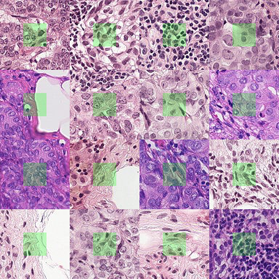

# tiny-DINOv3-FT-PCam

Specialize & compress a small DINOv3 (ViT‑S/16) for the [PCam histology dataset](https://github.com/basveeling/pcam).

> TL;DR:
>
> * Strong PCam classifier from a DINOv3 ViT‑S/16 backbone (best: 0.980 AUROC / 0.920 Sens@95%Spec).
> * Fine-tuning: LoRA matches near full fine‑tune; head-only training is not far behind.
> * Pruning: Architecture-preserving compression (attention‑head & MLP pruning + per‑layer SVD) → \~7% fewer params in this pass, although getting a significant performance hit (AUROC decreasing by \~0.025).
> * Quantization: Possible to bf16, halves memory footprint with no significant performance drop.
> * Easily replicable with a Makefile and scripts (steps below).
> * Tested on Apple M-series, GPU cluster (A100) with Slurm, logging with Weights & Biases.


<p align="center">
  
  
</p>

## Key results (PCam test set)

We use AUROC as the main metric. All runs use 224×224 inputs and test-time augmentation (TTA) at evaluation.


| Method | Quantization | Parameters | GFLOPs | Memory (MB) | AUROC | AUPRC | Sens \@95%Spec | ECE | Brier | Acc | NLL |
| --- | --- | --- | ---: | ---: | ---: | ---: | ---: | ---: | ---: | ---: | ---: |
| Full fine‑tune (FT) | none (f32) | 21.60M | 8.67 | 86.5 | 0.9800 | 0.9820 | 0.9202 | 0.0209 | 0.0603 | 0.9202 | 0.2116 |
| - | bf16 | 21.60M | 8.67 | 43.3 (↓50.0%) | 0.9800 | 0.9820 | 0.9195 | 0.0215 | 0.0602 | 0.9200 | 0.2115 |
| LoRA (r=8; attn+MLP adapters) | none (f32) | 21.60M | 8.67 | 86.5 | 0.9746 (↓0.6%) | 0.9786 | 0.9091 | 0.0148 | 0.0631 | 0.9190 | 0.2229 |
| - | bf16 | 21.60M | 8.67 | 43.3 (↓50.0%) | 0.9746 (↓0.6%) | 0.9785 | 0.9082 | 0.0146 | 0.0631 | 0.9183 | 0.2230 |
| Linear probe (head-only) | none (f32) | 21.60M | 8.67 | 86.5 | 0.9714 (↓0.9%) | 0.9742 | 0.8808 | 0.0186 | 0.0654 | 0.9131 | 0.2274 |
| - | bf16 | 21.60M | 8.67 | 43.3 (↓50.0%) | 0.9714 (↓0.9%) | 0.9742 | 0.8793 | 0.0177 | 0.0659 | 0.9122 | 0.2289 |
| Full FT + compression *(heads+MLP+SVD, τ=\[0.89, 0.975, 0.975])* | none (f32) | 20.08M (↓7.0%) | 8.06 (↓7.0%) | 80.4 (↓7.0%) | 0.9537 (↓2.7%) | 0.9630 | 0.8452 | 0.0408 | 0.1046 | 0.8553 | 0.3385 |
| - | bf16 | 20.08M (↓7.0%) | 8.06 (↓7.0%) | 40.3 (↓53.4%) | 0.9532 (↓2.7%) | 0.9628 | 0.8439 | 0.0390 | 0.1046 | 0.8545 | 0.3388 |
| LoRA + compression *(same τ)* | none (f32) | 20.08M (↓7.0%) | 8.06 (↓7.0%) | 80.4 (↓7.0%) | 0.9513 (↓2.9%) | 0.9607 | 0.8423 | 0.0322 | 0.1064 | 0.8527 | 0.3445 |
| - | bf16 | 20.08M (↓7.0%) | 8.06 (↓7.0%) | 40.3 (↓53.4%) | 0.9521 (↓2.8%) | 0.9612 | 0.8451 | 0.0321 | 0.1058 | 0.8538 | 0.3427 |
| Head-only + compression *(same τ)* | none (f32) | 20.08M (↓7.0%) | 8.06 (↓7.0%) | 80.4 (↓7.0%) | 0.9307 (↓5.0%) | 0.9314 | 0.6870 | 0.0230 | 0.1046 | 0.8577 | 0.3452 |
| - | bf16 | 20.08M (↓7.0%) | 8.06 (↓7.0%) | 40.3 (↓53.4%) | 0.9316 (↓4.9%) | 0.9323 | 0.6889 | 0.0226 | 0.1038 | 0.8591 | 0.3427 |

GFLOPs estimated with `ptflops`; memory footprint reflects the state dict size.

Takeaways:
* Full FT still leads (AUROC 0.980, Sens@95%Spec 0.920), but LoRA trails by only 0.005 AUROC with tighter calibration (ECE 0.0148 vs 0.0209).
* bf16 checkpoints halve memory requirements to ~43 MB with no measurable hit to accuracy, calibration, or sensitivity across the board.
* Linear probe remains a competitive lightweight option at 0.971 AUROC / 0.913 Acc, though sensitivity at high specificity lags the LoRA and full FT runs.
* Compression trims ~7% params/FLOPs but costs around 0.025 AUROC.

Note: For LoRA and Linear probe, we also allowed training of the backbone layer norms and biases.

## Repo overview & workflow

- Backbone & classifier: `DinoV3Backbone` wraps the `facebook/dinov3-vits16-pretrain-lvd1689m` encoder and feeds the `DinoV3PCam` head (`src/models/backbone_dinov3.py`).
- Data pipeline: `src/data/pcam_hf.py` loads PCam HDF5 splits with Hugging Face preprocessing, and `src/utils/data_utils.py` applies histology-friendly flips, 90° rotations, and color jitter.
- Training orchestration: `src/train/finetune.py` drives head-only probes, LoRA adapters, and full fine-tunes with cosine decay + warmup, Weights & Biases logging, and optional backbone LayerNorm/bias updates.
- LoRA adapters: `src/models/lora.py` exposes the modular `LoRALinear` layers plus merge/unmerge helpers so adapters can be toggled at evaluation or export time.
- Compression stack: `src/train/pruning.py` implements three types of pruning: attention-head, MLP-unit, and truncated-SVD (see Appendix) and can chain them before optional quantization.
- Quantization & footprint: `src/utils/memory_utils.py` estimates memory footprint and supports bf16 quantization.
- Evaluation & TTA: `src/utils/eval_utils.py` computes AUROC/AUPRC, calibration, sensitivity; heavy evaluations default to test-time augmentation (flips + 90° rotations) to reduce orientation sensitivity, which stabilizes calibration on histology patches.
- Reporting: `src/utils/roc_plot.py` plots ROC curves from exported probabilities, and evaluation runs append predictions to `reports/results_probs.csv` for downstream analysis.

## Quickstart

> Works on Apple MPS (except bf16 quantization) or a GPU cluster (A100). Uses Python 3.12+ with uv.

Prerequisites:
- Access to the [DINOv3 weights on Hugging Face](https://huggingface.co/facebook/dinov3-vits16-pretrain-lvd1689m) and a `huggingface-cli login`.
- If using a cluster (SLURM), adjust a few cluster specific variables at the top of the `Makefile` to suit your environment.

```bash
# 0) Setup
uv sync                   # install deps
make get-data             # download PCam into src/data/pcam

# 1) Baselines (choose method: head_only | lora | fullft)
# Local: make baseline
# Cluster (SLURM): make sbaseline
make baseline METHOD=head_only EPOCHS=8  # linear probe
make baseline METHOD=lora # LoRA (q/k/v/o + MLP)
make baseline METHOD=fullft # full fine‑tune

# 2) Evaluate + compress a saved checkpoint
# Local: make eval
# Cluster (SLURM): make seval
# CHECKPOINT: absolute path or relative to checkpoints/saved/
# (methods: attention_heads, mlp_neurons, truncated_svd; combine with commas)
make eval CHECKPOINT=lora.pt \
  PRUNE_TARGETS=all \
  PRUNE_METHOD=attention_heads,mlp_neurons,truncated_svd \
  PRUNE_AMOUNT=attention_heads=0.89,mlp_neurons=0.975,truncated_svd=0.975
# Exports per-sample predictions to reports/results_probs.csv,
# Optional: append QUANTIZE=bf16 to evaluate with BF16 weights (supported devices only).
```

Numerous hyperparameters/settings are available (LoRA r, alpha, dropout; different learning rates for different parts of the network; label smoothing, grad clip...), see the makefile and the appendix for a full list.

In addition of W&B logging, all evaluation runs append per-sample probabilities to `reports/results_probs.csv` for offline analysis.

Steps to reproduce the results:

```bash
uv sync
make get-data
# Change cluster specific variables at the top of the makefile
bash scripts/repro_finetuning.sh --wandb  # remove flag for no W&B logging
# Place the checkpoints in checkpoints/saved/ with names head_only.pt, lora.pt, fullft.pt
bash scripts/repro_pruning.sh --wandb  # remove flag for no W&B logging
```

## Dataset background

### PCam in a nutshell
- PatchCamelyon (PCam) is a binary classification dataset built from small patches extracted from histopathology whole-slide images (WSIs) of lymph node sections. Each patch is labeled positive if tumor (metastatic breast carcinoma) tissue is present in the central 32×32 px region; otherwise negative.
- Size & shape: 327,680 RGB patches of size 96×96 pixels.
- Splits: Train 262,144, val 32,768, test 32,768, each 50/50 class-balanced with no WSI overlap between splits to avoid leakage.
- Patches are sampled from CAMELYON16 WSIs. Slides were scanned at 40× (≈0.243 μm/px) across two centers and downsampled to 10× for patch selection.

### Practical notes
- No leakage by construction. We keep the PCam split guarantee (no overlapping WSIs across train/val/test).
- Histology-friendly augmentations: we use flips, 90° rotations, and light color jitter; we enable test-time augmentation (TTA).
- Resolution. Our models train/evaluate at 224×224; PCam patches are upsampled from 96×96 in the preprocessing pipeline.

## Environment

* Hardware tested: MacBook Air M4 (10C CPU / 10C GPU / 24GB RAM) and Slurm cluster with A100‑40GB.
* Frameworks: PyTorch 2.x, torchvision, Hugging Face Transformers.
* Data: PCam HDF5 official splits (no WSI leakage by construction).

## License & checkpoints

* Code: MIT (see `LICENSE`).
* Backbone / fine‑tuned weights: subject to Meta’s DINOv3 license (HF gated). Do not redistribute weights without complying with the DINOv3 terms.
* Data: PCam (CC0) per the PCam repository.

## Folder map

```
src/
  data/pcam_hf.py         # PCam HDF5 dataset w/ HF preprocessing
  models/
    backbone_dinov3.py    # DINOv3 backbone + classifier head
    lora.py               # LoRA modules and injection utilities
  train/
    finetune.py           # training loops + W&B logging
    pruning.py            # attention/MLP pruning & SVD compression
  utils/
    eval_utils.py         # metrics, eval, timing, FLOPs helpers
    roc_plot.py           # ROC plotting from exported probabilities
    memory_utils.py       # state_dict sizing + quantization helpers
scripts/
  download_pcam.py        # dataset fetcher
  repro_finetuning.sh     # baseline fine-tuning recipes
  repro_pruning.sh        # evaluation/compression recipes
```

## Appendix: Pruning methods applied in the code

We use three graph-safe compressions that keep external I/O shapes intact while shrinking internal channels/rank. Each uses an energy keep-fraction $\tau \in (0,1]$ and always keeps at least one unit.

### 1. Attention-head pruning (by $o\_\text{proj}$ energy).
Let a block have $H$ heads, model dim $d_{\text{model}}$, head dim $d_h=d_{\text{model}}/H$, and output projection $W_o\in\mathbb{R}^{d_{\text{model}}\times d_{\text{model}}}$. For head $h$, define its input-column slice $S_h=\\{h d_h,\dots,(h+1)d_h-1\\}$ which is the columns of $W_o$ corresponding to that head.

Score and energy (Pytorch: out x in):

$$
s_h=\left\lVert W_o[:,S_h]\right\rVert_F,\qquad e_h=s_h^2.
$$

Sort $e_{(1)}\ge\cdots\ge e_{(H)}$. Choose the smallest $K$ s.t.

$$
\frac{\sum_{i=1}^{K} e_{(i)}}{\sum_{j=1}^{H} e_{(j)}}\ \ge\ \tau.
$$

Keep those $K$ heads. Implement by selecting the corresponding output rows in $W_q,W_k,W_v$ and input columns in $W_o$ (bias of $o$ unchanged); update the block’s head count to $K$.

### 2. MLP-neuron pruning (width reduction by multiplicative salience).
For an MLP with $W_{\text{up}}\in\mathbb{R}^{r\times d_{\text{in}}}$ and $W_{\text{down}}\in\mathbb{R}^{d_{\text{out}}\times r}$, define for hidden unit $i$:

$$
a_i=\bigl\lVert (W_{\text{up}})_{i,:}\bigr\rVert_2,\quad
b_i=\bigl\lVert (W_{\text{down}})_{:,i}\bigr\rVert_2,\quad
s_i=a_i \cdot b_i,\quad e_i=s_i^2.
$$

Sort $e_{(1)}\ge\cdots\ge e_{(r)}$. Keep the smallest $k$ s.t.

$$
\frac{\sum_{i=1}^{k} e_{(i)}}{\sum_{j=1}^{r} e_{(j)}}\ \ge\ \tau.
$$

Subselect rows of $W_{\text{up}}$ and columns of $W_{\text{down}}$ to width $k$ (biases subset accordingly). Input/output dims are unchanged.

### 3. Truncated-SVD linear compression (per layer).
For a linear $y=xW^\top+b$ with $W\in\mathbb{R}^{\text{out}\times\text{in}}$, compute the thin SVD

$$
W=U\Sigma V^\top,\quad \Sigma=\mathrm{diag}(\sigma_1,\dots,\sigma_m),\ m=\min(\text{out},\text{in}).
$$

Pick the smallest rank $r$ s.t.

$$
\frac{\sum_{i=1}^{r}\sigma_i^{\,2}}{\sum_{j=1}^{m}\sigma_j^{\,2}}\ \ge\ \tau,
$$

then use the rank $r$ approximation $W\approx U_r\Sigma_r V_r^\top$ and realize it as two linears:

$$
xW^\top \approx (xV_r) (U_r\Sigma_r)^\top.
$$

We apply this only if it reduces parameters.

## Appendix: Hyperparameter reference

### Training-only hyperparameters
- `--method` (default `head_only`; choices `head_only`, `fullft`, `lora`) – selects which parameters train.
- `--lr_head`/`--lr_backbone`/`--lr_lora` – override optimizer learning rates for the classifier head, backbone, or LoRA adapters.
- `--lora_r` (default `8`), `--lora_alpha` (default `16`), `--lora_dropout` (default `0.0`) – configure LoRA rank, scaling, and dropout.
- `--lora_targets` (default `q_proj,k_proj,v_proj,o_proj`) – comma-separated linear layers to wrap with LoRA; add `up_proj,down_proj` when adapters should cover MLPs.
- `--lora_include_mlp` – boolean flag to inject LoRA modules into MLP projections automatically.
- `--train_log_every_steps` (default `50`) – logging cadence for training metrics (`0` disables).
- `--val_eval_frac` (default `0.25`) – fraction of an epoch between mid-epoch validation passes.
- `--val_mid_epoch`/`--val_epoch_end` – toggle mid-epoch and end-of-epoch validation loops.
- `--val_heavy_mid`/`--val_heavy_end`/`--val_heavy_zero` – enable full metric suites during the corresponding validation passes.
- `--batch_size` (default `128`) – training mini-batch size; `--val_batch_size` is shared but can still be overridden for training runs.
- `--epochs` (default `10`), `--lr` (default `1e-3`), `--weight_decay` (default `1e-4`), `--seed` (default `1337`) – core optimization controls.
- `--max_train_batches` (default `0`) – cap the number of training batches per epoch (`0` means full epoch).
- `--skip_bench`/`--lat_warmup` (default `20`)/`--lat_iters` (default `100`) – control latency/GFLOPs benchmarking during training.
- `--save_dir` (default `checkpoints`), `--save_last`, `--save_best` – configure checkpoint persistence.
- `--train_norms_bias` (choices `none`, `norms`, `bias`, `both`) and `--lr_norms_bias` – opt into training backbone LayerNorms/biases for head-only or LoRA modes and set their learning rate.
- `--warmup_steps` (default `200`) – number of linear warmup steps before cosine decay.
- `--grad_clip` (default `1.0`) – gradient norm clip (`0` disables).
- `--label_smoothing` (default `0.0`) – apply cross-entropy label smoothing.
- `--val_epoch0` – evaluate the checkpoint before any training updates.
- `--aug_histology` – enable histology-specific augmentation recipe.
- `--select_metric` (default `auroc`; choices `val_loss`, `auroc`, `sens95`, `nll`, `brier`, `ece`, `acc`) – metric used to pick the best checkpoint.

### Pruning & quantization hyperparameters
- `--checkpoint` (required) – checkpoint path; relative paths resolve inside `checkpoints/saved`.
- `--prune_method` (default `none`) – comma-separated sequence of compression passes (`truncated_svd`, `attention_heads`, `mlp_neurons`).
- `--prune_amount` (default `0.95`) – energy keep-threshold; accepts a single float or per-method overrides like `attention_heads=0.9,truncated_svd=0.85`.
- `--prune_targets` (default `q_proj,k_proj,v_proj,o_proj,up_proj,down_proj`) – layer name substrings for SVD compression (`all` or `*` selects every known target).
- `--wandb_run_name` – display name for evaluation runs logged to W&B.
- `--results_csv` (default `reports/results_probs.csv`) – file that collects per-sample predictions.
- `--results_run_name` – optional identifier stored alongside exported probabilities.
- `--compute_flops` – enable GFLOPs reporting with `ptflops`.
- `--quantize` (default `none`; choices `none`, `int8`, `bf16`) – post-pruning quantization mode.

### Shared hyperparameters (training & pruning)
- `--data_dir` (default `src/data/pcam`) – location of the PCam dataset; overridable via `make baseline` / `make seval` variables.
- `--model_id` (default `facebook/dinov3-vits16-pretrain-lvd1689m` for training; optional override for pruning) – Hugging Face backbone identifier.
- `--resolution` (default `224` for training; inherits from checkpoint when unspecified during pruning) – input image size in pixels.
- `--val_batch_size` (default `256`) – evaluation batch size.
- `--num_workers` (default `4`) – DataLoader subprocess count.
- `--tta_eval` – toggle test-time augmentation during heavy evaluation passes.
- `--max_eval_batches` (default `0`) – limit validation/test batches processed per epoch run (`0` = full set).
- `--wandb`, `--wandb_project` (default `dinov3-pcam-compress`), `--wandb_entity`, `--wandb_mode` (choices `online`, `offline`, inherit env) – control Weights & Biases logging.

